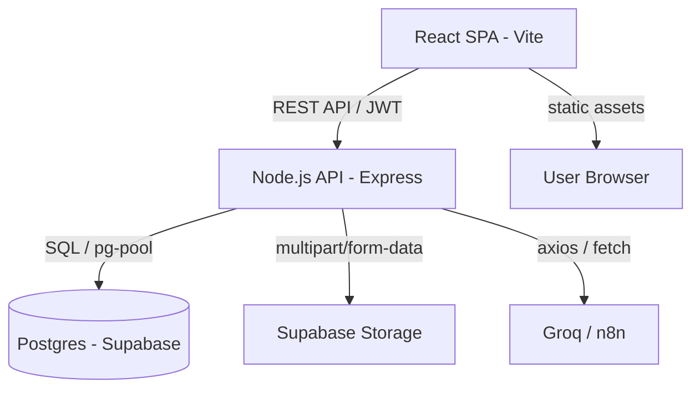

# Architecture Overview — Tripoli Explorer Web

This document describes the high-level architecture and data flow of the Tripoli Explorer Web application.

## System Diagram

## Components

### 1. Frontend (Client)
- **Tech Stack**: React 19, Vite, React Router, Vanilla CSS.
- **Role**: Handles UI/UX, routing, and user interactions.
- **Data Fetching**: Custom `api/client.js` with deduplication and retry logic.
- **State Management**: React Context (`AuthContext`, `LanguageContext`).

### 2. Backend (Server)
- **Tech Stack**: Node.js, Express, `pg` (node-postgres).
- **Role**: Provides a secure REST API for the frontend and mobile app.
- **Authentication**: JWT-based. Shares the same `JWT_SECRET` and `DATABASE_URL` as the mobile backend.
- **Features**:
    - **Inquiries**: Visitor messaging system.
    - **Trips**: User trip planning.
    - **Feed**: Community engagement.
    - **AI Planner**: Intelligence layer using Groq or n8n.

### 3. Database (Shared)
- **Hosting**: Supabase (Postgres).
- **Ownership**: The core schema is owned by the [Tripoli Explorer Mobile App](https://github.com/abdalrahmanhajjo/VisitTripoliApp).
- **Web Migrations**: This repo contains incremental migrations for web-specific features (e.g., translation overrides, site settings).

## Data Flow

1. **Authentication**:
   - User logs in via `/api/auth/login`.
   - Server validates credentials against the `users` table.
   - Server returns a JWT.
   - Client stores the JWT in `localStorage` and includes it in the `Authorization` header for protected requests.

2. **AI Trip Planning**:
   - Client sends a prompt to `/api/ai/complete`.
   - Server prepares a context-rich prompt (including places/interests).
   - Server calls Groq (Llama 3) or an n8n webhook.
   - Server returns structured slots which the client renders as a trip plan.

3. **Inquiries**:
   - Public users can send messages to venues.
   - Server stores these in `place_inquiries`.
   - Business owners can view and reply via the `/business` console.
